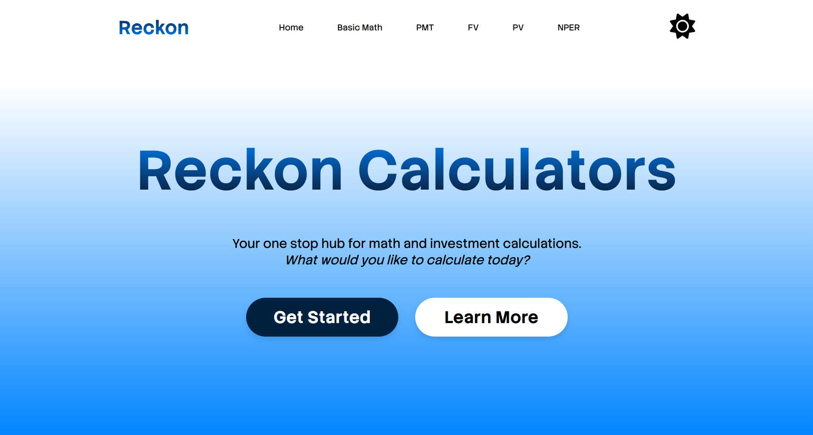
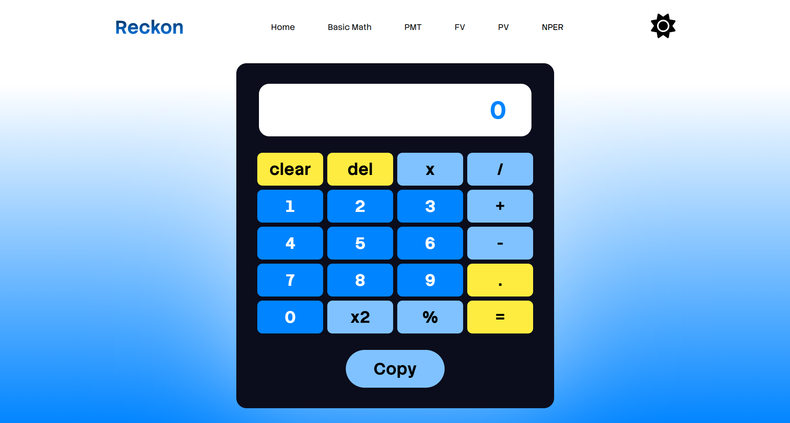
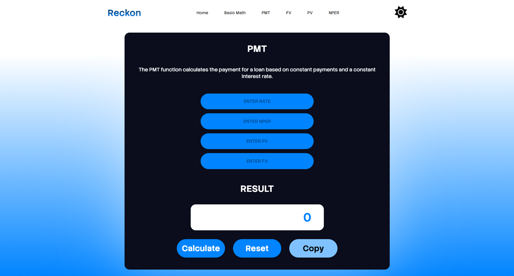

# Reckon 🧮💸

A web-based calculator application with basic math (addition, subtraction, multiplication, and division) and investment functions (PMT (payment), NPER (number of periods), PV (present value) and FV (future value)).

## How it works?

It's simple.

1. As you open the application, you are presented with the basic math and investment functions. Choose one.
2. If you chose basic math, you input your values and calculate. If you chose an investment function, you input the respective values based on your knowledge of investment calculation. A definition of the function will be on screen.
3. When finished, click the "Calculate" button and the result will appear.

## Try it Yourself!

Visit [the website.](https://reckon-p.netlify.app/)

**OR**

Download this calculator application from Github or from my Portfolio website.

**_NB: Please note that this an upcoming feature and it will be electron-based._**

### Feedback

To give feedback, please visit my Portfolio website and contact me from there.

#

© 2026. All rights reserved. Zamar Wint, software engineer.
